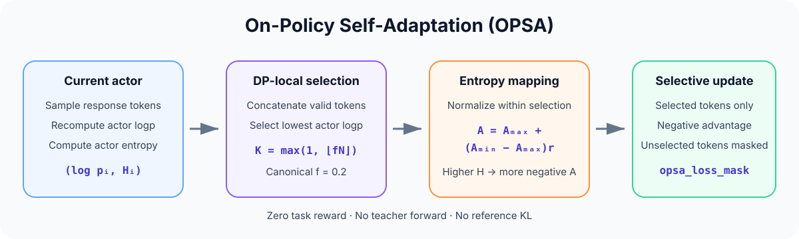

# OPSA: On-Policy Self-Adaptation

[中文说明](README_zh.md)

OPSA is a teacher-free training method that concentrates policy updates on the
response tokens that the current student actor finds least likely. It selects
the lowest-log-probability tokens and assigns token-level negative advantages
from their actor entropy.



This repository is organized as an OPSA project. The complete modified
[Slime](https://github.com/THUDM/slime) framework is kept as the independent
[`slime/`](slime/) subproject, while the repository-level documentation and
assets describe OPSA.

## Method

On every data-parallel rank, OPSA concatenates the valid response tokens in the
local packed training batch. Let \(N\) be the number of valid tokens and \(f\)
the selected fraction. It selects the tokens with the lowest log probabilities
recomputed by the current Megatron actor:

$$
K = \max(1, \lfloor fN \rfloor).
$$

For each selected token, entropy is min-max normalized within that selected
set:

$$
r_i = \frac{H_i-H_{\min}}{H_{\max}-H_{\min}},
\qquad
A_i = A_{\max} + (A_{\min}-A_{\max})r_i.
$$

The canonical configuration uses \(f=0.2\), \(A_{\min}=-1.0\), and
\(A_{\max}=-0.5\). If all selected entropies are equal, every selected token
receives \(-1.0\). Unselected tokens receive zero advantage and are excluded
from both the policy-loss numerator and denominator.

Selection is DP-local: tokens are never ranked across data-parallel workers.
OPSA uses zero task reward and performs no reference-model forward pass or KL
loss.

## Included configurations

| Configuration | Selected tokens | Advantage |
|---|---|---|
| Canonical OPSA | Lowest 20% actor logp by default | Entropy-mapped from `-0.5` to `-1.0` |
| Fixed negative | Same lowest-token selector | `-0.5` |
| Fixed positive | Same lowest-token selector | `+0.2` |
| Fraction sweep | Lowest 10/20/30/40% | Canonical entropy mapping |

The OPSA and standard OPD surfaces intentionally exclude historical entropy
thresholds, special EOS/think masks, position reweighting, clipping, forced
values, top-1 branches, random branches, experiment outputs, and
machine-specific paths.

## Repository layout

- [`slime/`](slime/) — installable modified Slime project and native runtime.
- [`slime/examples/opsa/`](slime/examples/opsa/) — OPSA launchers, model presets,
  checkpoint conversion, fixed-advantage ablations, and fraction sweeps.
- [`slime/examples/on_policy_distillation/`](slime/examples/on_policy_distillation/)
  — compact standard OPD baselines using SGLang or a same-architecture Megatron
  teacher.
- [`slime/tests/test_opsa.py`](slime/tests/test_opsa.py) and
  [`slime/tests/test_opsa_loss_mask.py`](slime/tests/test_opsa_loss_mask.py) —
  CPU tests for the selector, arguments, masks, and loss normalization.
- [`UPSTREAM.md`](UPSTREAM.md) — snapshot provenance and upstream attribution.

Datasets, Hugging Face checkpoints, Megatron checkpoints, and Megatron-LM are
external dependencies and are not included.

## Quick start

```bash
git clone https://github.com/DripNowhy/On-Policy-Self-Adaptation.git
cd On-Policy-Self-Adaptation/slime
pip install -e .
```

Inspect a complete configuration without allocating GPUs or requiring local
datasets and checkpoints:

```bash
bash examples/opsa/run_opsa.sh \
  --model qwen3-1.7b \
  --preset opsa \
  --fraction 0.2 \
  --dry-run
```

Run either fixed-advantage ablation:

```bash
bash examples/opsa/run_opsa.sh --model qwen3-1.7b --preset fixed-negative --dry-run
bash examples/opsa/run_opsa.sh --model qwen3-1.7b --preset fixed-positive --dry-run
```

Expand the sequential 10/20/30/40% sweep:

```bash
bash examples/opsa/run_lowest_sweep.sh --model qwen3-1.7b --dry-run
```

See the [full reproducibility guide](slime/examples/opsa/README.md) before
removing `--dry-run`.

## Public OPSA interface

```text
--advantage-estimator opsa
--opsa-mode {entropy,fixed}
--opsa-token-fraction FLOAT
--opsa-advantage-min FLOAT
--opsa-advantage-max FLOAT
--opsa-fixed-advantage FLOAT
```

Entropy mode automatically requests actor entropy. Fixed mode does not compute
entropy. OPSA is mutually exclusive with standard OPD and advantage
normalization.

## Model presets

| Model | Steps | Actor / rollout GPUs | TP | Rollout / eval length | Max tokens/GPU |
|---|---:|---:|---:|---:|---:|
| Qwen3-1.7B | 700 | 4 / 4 | 1 | 12k / 32k | 16,384 |
| Qwen3-4B Base | 1,000 | 4 / 4 | 2 | 12k / 32k | 24,576 |
| Qwen3.5-9B | 1,000 | 2 / 6 | 2 | 16k / 32k | 32,768 |

All presets use non-thinking generation, batch size 64, learning rate `1e-6`,
and save/evaluation intervals of 20. Qwen3.5-9B retains optimizer CPU offload
and has an optional `flash-linear-attention==0.4.1` dependency.

## Validation status

This release is CPU- and CLI-validated. The tests cover DP-local selection,
10/20/30/40% fractions, the at-least-one-token rule, equal entropy, fixed
positive and negative advantages, empty/malformed inputs, loss masking,
argument validation, reference-free startup, and standard OPD regression
behavior. The launchers are syntax checked and exercised with `--dry-run`.

No end-to-end GPU training of the three public model presets was repeated as
part of this cleanup.

## Upstream and license

The implementation is based on a local Slime snapshot at commit `594c562`,
with public reference point
[`THUDM/slime@0988f0f`](https://github.com/THUDM/slime/commit/0988f0f4a0ab55d1bb3ce6285a597d912144fa80).
See [`UPSTREAM.md`](UPSTREAM.md) for details.

This repository is released under the [Apache License 2.0](LICENSE).
