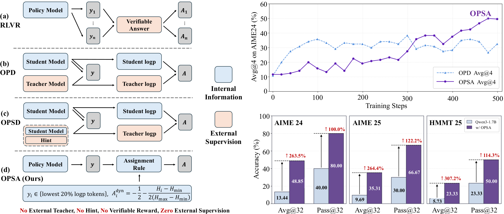

<div align="center">

# Does On-Policy Distillation Really Distill? From Noisy Teacher to Self-Improvement

**只使用当前策略自身的 token probability 和 entropy 进行无需 teacher 的 on-policy 训练。**

[](https://arxiv.org/pdf/2608.31046)
[](https://github.com/DripNowhy/On-Policy-Self-Adaptation)
[](https://dripnowhy.github.io/On-Policy-Self-Adaptation/)
[](https://wandb.ai/whywhyyy0731-purdue-university/opsa-public/workspace?nw=nwuserwhywhyyy0731)
[](https://huggingface.co/collections/Tuwhy/on-policy-self-adaptation)
[](LICENSE)

[English](README.md) · **中文**

<p>
  <a href="#introduction">📖 简介</a> •
  <a href="#results">📊 结果</a> •
  <a href="#reproduce-opsa">🚀 复现 OPSA</a> •
  <a href="#dataset-preparation">🗂️ 数据集准备</a>
</p>
<p>
  <a href="#training-logs">📈 训练日志</a> •
  <a href="#license">📄 许可证</a>
</p>

</div>

<a id="introduction"></a>

## 简介

OPSA 不需要 teacher model、reward model、reference-model forward 或 task
reward。Canonical 配置只训练有效 response token 中 actor log probability
最低的 20%，并根据 entropy 分配 `-0.5` 到 `-1.0` 的 negative advantage。
其余 token 全部从 policy loss 中排除。

<p align="center">
  
</p>

<a id="results"></a>

## 结果

三个数学 benchmark 列均为 **Avg@32 / Pass@32**；两个 O.O.D. 列仅为
**Avg@32**。单位均为百分比，所有数值均来自 OPSA 论文。

| 模型 | 版本 | AIME24 | AIME25 | HMMT25 | MBPP+ Avg@32 | GPQA_D Avg@32 |
|---|---|---:|---:|---:|---:|---:|
| Qwen3-1.7B | Base | 13.44 / 40.00 | 9.69 / 30.00 | 5.73 / 23.33 | 58.24 | 27.92 |
| Qwen3-1.7B | **+ OPSA** | **48.85 / 80.00** | **35.31 / 66.67** | **23.33 / 50.00** | **59.44** | **32.40** |
| Qwen3-4B | Base | 23.33 / 56.67 | 20.52 / 56.67 | 13.13 / 33.33 | 66.93 | 38.46 |
| Qwen3-4B | **+ OPSA** | **62.08 / 83.33** | **58.44 / 83.33** | **37.40 / 60.00** | **68.35** | **41.29** |
| Qwen3.5-9B | Base | 76.35 / 93.33 | 56.04 / 93.33 | 44.48 / 86.67 | 77.33 | 70.53 |
| Qwen3.5-9B | **+ OPSA** | **87.81 / 96.67** | **76.98 / 96.67** | **67.40 / 93.33** | **79.27** | **73.70** |

所有模型均使用 non-thinking 模式训练和评测。训练只使用 DAPO-17k 中的问题。
评测时每道题采样 32 个 response，temperature 为 `0.7`、top-k 为 `20`、
top-p 为 `0.8`、最大 response length 为 `32,768`。

<a id="reproduce-opsa"></a>

## 复现 OPSA

### 安装

```bash
git clone https://github.com/DripNowhy/On-Policy-Self-Adaptation.git
cd On-Policy-Self-Adaptation/slime
pip install -e .
```

<a id="dataset-preparation"></a>

### 数据集准备

安装 Hugging Face CLI，并指定一个仓库外部的数据目录：

```bash
python3 -m pip install --upgrade huggingface_hub
export OPSA_DATA_DIR=/path/to/opsa-data
mkdir -p "${OPSA_DATA_DIR}"
```

下载本项目实际使用的 pinned Slime-ready JSONL：

```bash
hf download zhuzilin/dapo-math-17k dapo-math-17k.jsonl \
  --repo-type dataset \
  --revision 2e65612930298bde4c5d58fd97b3f23a483aaff9 \
  --local-dir "${OPSA_DATA_DIR}/dapo-math-17k"

hf download zhuzilin/aime-2024 aime-2024.jsonl \
  --repo-type dataset \
  --revision 1c625e328db94ec7ef7ff169016b097c468d60b9 \
  --local-dir "${OPSA_DATA_DIR}/aime-2024"
```

下载后的训练文件有 17,398 行，AIME24 评测文件有 30 行。两者都已经包含所需的
`prompt` 和 `label` 字段，不需要额外转换。OPSA 训练只读取 `prompt`，并且
task reward 恒为零；只有评测时才会读取 `label`。

训练 JSONL 是
[原始 DAPO-Math-17k](https://huggingface.co/datasets/BytedTsinghua-SIA/DAPO-Math-17k)
对应的 pinned
[Slime-ready mirror](https://huggingface.co/datasets/zhuzilin/dapo-math-17k)。
为了精确复现，请使用这个 mirror，不要直接替换成当前包含重复数据的 179 万行
upstream parquet。AIME24 文件来自
[Slime-ready AIME24 mirror](https://huggingface.co/datasets/zhuzilin/aime-2024)。
这些外部数据集分别遵循其自身的使用条款。

### CPU dry run

该命令只展开并打印完整配置，不检查路径、不查询 GPU、不启动 Ray，也不会开始训练：

```bash
bash examples/opsa/run_opsa.sh \
  --model qwen3-1.7b \
  --preset opsa \
  --fraction 0.2 \
  --dry-run
```

### GPU 训练

训练前还需要准备 Hugging Face checkpoint、由它转换得到的 Megatron actor
checkpoint，以及 Megatron-LM。转换方法见
[checkpoint 转换说明](slime/examples/opsa/README.md#prepare-checkpoints)。

替换下面的模型和输出路径后，该命令会在单机 8 张 GPU 上启动 canonical
Qwen3-1.7B OPSA：

```bash
bash examples/opsa/run_opsa.sh \
  --model qwen3-1.7b \
  --preset opsa \
  --fraction 0.2 \
  --hf-checkpoint /path/to/Qwen3-1.7B \
  --actor-checkpoint /path/to/qwen3-1.7b-megatron \
  --save-dir /path/to/outputs/opsa-qwen3-1.7b-lowest20 \
  --prompt-data "${OPSA_DATA_DIR}/dapo-math-17k/dapo-math-17k.jsonl" \
  --eval-data "${OPSA_DATA_DIR}/aime-2024/aime-2024.jsonl" \
  --megatron-path /path/to/Megatron-LM
```

该 preset 使用 4 张 actor GPU 和 4 张 rollout GPU，共训练 700 steps，每
20 steps 保存和评测一次。Launcher 会自动启动本地 Ray，并且退出时只停止自己
启动的集群。已有 Ray 集群和其他模型的用法见
[launcher 说明](slime/examples/opsa/README.md)。

<a id="training-logs"></a>

## 训练日志

训练曲线和指标可以参考
[公开 W&B workspace](https://wandb.ai/whywhyyy0731-purdue-university/opsa-public/workspace?nw=nwuserwhywhyyy0731)。

<a id="license"></a>

## 许可证

本项目基于 [slime](https://github.com/THUDM/slime)，使用
[Apache License 2.0](LICENSE)。快照来源见 [UPSTREAM.md](UPSTREAM.md)。
