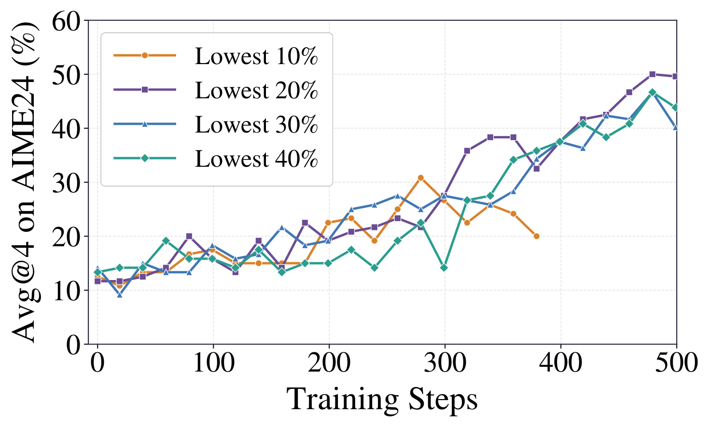

<div align="center">

# OPSA: On-Policy Self-Adaptation

**无需 teacher 的 RL 目标：只使用当前策略自己的信号，学习它最意想不到的 token。**

[](https://github.com/DripNowhy/On-Policy-Self-Adaptation)
[](https://wandb.ai/whywhyyy0731-purdue-university/opsa/workspace)
[](slime/examples/opsa/README.md)
[](https://github.com/THUDM/slime)
[](LICENSE)

[English](README.md) · **中文**

<p>
  <a href="#introduction">📖 简介</a> •
  <a href="#method">🧠 方法</a> •
  <a href="#main-results">📊 主要结果</a> •
  <a href="#getting-started">✨ 快速开始</a>
</p>
<p>
  <a href="#ablations">🧪 消融实验</a> •
  <a href="#model-presets">📦 模型配置</a> •
  <a href="#reference">🔧 参考信息</a>
</p>

</div>

> 只使用当前策略自己产生的信号，在策略最不确定的位置进行适应。

<a id="introduction"></a>
# 📖简介

**OPSA 研究 student policy 能否在没有 teacher model、reward model、
reference model 和 task reward 的情况下完成自适应。**

当前 actor 先找出自己认为最不可能出现的 response token，训练时只更新这些 token。
它们的 negative advantage 再由 actor 自己的 entropy 塑形：在已选 token 中，
不确定性越高，分配的 negative advantage 越强。

<p align="center">
  
</p>

<p align="center"><sub>来自 OPSA 论文的总览图。</sub></p>

|  | |
|---|---|
| 🚫 **无需 teacher** | 不需要 teacher model、reward model、reference forward 或 KL 项，task reward 恒为零。 |
| 🎯 **稀疏 token 更新** | 梯度只流经有效 response token 中 actor logp 最低的一部分，默认 20%。 |
| 🌡️ **Entropy 塑形** | 将已选 token 的 entropy 映射为 `-0.5` 到 `-1.0` 的 negative advantage。 |

<a id="method"></a>
# 🧠方法

在每个 data-parallel rank 上，OPSA 对本地 packed training batch 执行三个步骤：

1. **打分。** 当前 Megatron actor 为每个有效 response token 重算 sampled-token
   log probability 和 entropy。
2. **选择。** 拼接本 rank 的有效 token 后，选择 actor logp 最低的比例：

   $$K = \max(1, \lfloor fN \rfloor).$$

3. **塑形与更新。** 仅在已选 token 内对 entropy 做 min-max normalization：

   $$
   r_i = \frac{H_i-H_{\min}}{H_{\max}-H_{\min}},
   \qquad
   A_i = A_{\max} + (A_{\min}-A_{\max}) r_i.
   $$

Canonical OPSA 使用 $f=0.2$、$A_{\min}=-1.0$ 和 $A_{\max}=-0.5$。
如果已选 token 的 entropy 全部相同，它们都获得 `-1.0`。未选 token 的
advantage 为零，并且同时从 policy-loss 的分子和分母中移除。

> [!NOTE]
> 选择过程是 **DP-local** 的，不会跨 data-parallel worker 排序 token。
> OPSA 使用 zero task reward，不执行 reference-model forward，也不计算 KL loss。

<a id="main-results"></a>
# 📊主要结果

下表是 OPSA 论文报告的主要结果。每个 benchmark 单元格均为
**Avg@32 / Pass@32**，数值单位为百分比。

| 模型 | 版本 | AIME24 | AIME25 | HMMT25 | MBPP+ |
|---|---|---:|---:|---:|---:|
| Qwen3-1.7B | Base | 13.44 / 40.00 | 9.69 / 30.00 | 5.73 / 23.33 | 58.24 / 70.10 |
| Qwen3-1.7B | **+ OPSA** | **48.85 / 80.00** | **35.31 / 66.67** | **23.33 / 50.00** | **59.44 / 73.02** |
| Qwen3-4B | Base | 23.33 / 56.67 | 20.52 / 56.67 | 13.13 / 33.33 | 66.93 / 74.34 |
| Qwen3-4B | **+ OPSA** | **62.08 / 83.33** | **58.44 / 83.33** | **37.40 / 60.00** | **68.35 / 75.67** |
| Qwen3.5-9B | Base | 76.35 / 93.33 | 56.04 / 93.33 | 44.48 / 86.67 | 77.33 / 91.27 |
| Qwen3.5-9B | **+ OPSA** | **87.81 / 96.67** | **76.98 / 96.67** | **67.40 / 93.33** | **79.27 / 92.53** |

所有模型均使用 non-thinking 模式训练和评测。训练只使用 DAPO-17k 的问题，
不读取标签或 ground-truth answer。评测使用 SGLang，每道题采样 32 个 response，
temperature `0.7`、top-k `20`、top-p `0.8`、最大生成长度 `32,768`；
checkpoint 按 validation Avg@4 选择。

部分 Qwen3-1.7B 和 Qwen3-4B 训练曲线已公开在
[W&B workspace](https://wandb.ai/whywhyyy0731-purdue-university/opsa/workspace)。

<a id="getting-started"></a>
# ✨快速开始

## 环境安装

```bash
git clone https://github.com/DripNowhy/On-Policy-Self-Adaptation.git
cd On-Policy-Self-Adaptation/slime
pip install -e .
```

## 复现 OPSA

无需分配 GPU，也不要求本地数据集和 checkpoint，先检查完整展开后的 canonical
配置：

```bash
bash examples/opsa/run_opsa.sh \
  --model qwen3-1.7b \
  --preset opsa \
  --fraction 0.2 \
  --dry-run
```

> [!NOTE]
> 移除 `--dry-run` 前，请按照[完整复现指南](slime/examples/opsa/README.md)
> 提供外部 Hugging Face checkpoint、Megatron checkpoint、训练/评测数据和
> Megatron-LM 路径。

<a id="ablations"></a>
# 🧪消融实验

OPSA 只保留一组紧凑、可控的消融。所有 fixed-advantage 变体与 canonical OPSA
复用完全相同的 lowest-token selector。

| 配置 | 选择的 token | Advantage |
|---|---|---|
| **Canonical OPSA** | 默认 actor logp 最低 20% | 按 entropy 从 `-0.5` 映射到 `-1.0` |
| **Fixed negative** | 相同的 lowest-token selector | `-0.5` |
| **Fixed positive** | 相同的 lowest-token selector | `+0.2` |
| **Fraction sweep** | 最低 10 / 20 / 30 / 40% | Canonical entropy mapping |

<p align="center">
  
</p>

<p align="center">
  <sub>论文中的 selected-token fraction 消融：lowest 20%、30% 和 40% 在 AIME24 上最终均达到 45 以上 Avg@4。</sub>
</p>

```bash
# Fixed-advantage 对照
bash examples/opsa/run_opsa.sh --model qwen3-1.7b --preset fixed-negative --dry-run
bash examples/opsa/run_opsa.sh --model qwen3-1.7b --preset fixed-positive  --dry-run

# 顺序执行 lowest-token fraction sweep
bash examples/opsa/run_lowest_sweep.sh --model qwen3-1.7b --dry-run
```

历史实验中的 entropy threshold、EOS/think mask、position reweighting、
clipping、forced value、top-1/random 分支、仅用于 trace 的代码、实验产物和
机器相关路径均已删除。

<a id="model-presets"></a>
# 📦模型配置

| 模型 | Steps | Actor / rollout GPU | TP | Rollout / eval length | Max tokens/GPU |
|---|---:|---:|---:|---:|---:|
| **Qwen3-1.7B** | 700 | 4 / 4 | 1 | 12k / 32k | 16,384 |
| **Qwen3-4B Base** | 1,000 | 4 / 4 | 2 | 12k / 32k | 24,576 |
| **Qwen3.5-9B** | 1,000 | 2 / 6 | 2 | 16k / 32k | 32,768 |

三个 preset 均使用 non-thinking generation、batch size 64、learning rate
`1e-6` 和 save/evaluation interval 20。Qwen3.5-9B 保留 optimizer CPU
offload，并提供可选依赖 `flash-linear-attention==0.4.1`。

<a id="reference"></a>
# 🔧参考信息

<details>
<summary><b>OPSA 公开参数</b></summary>

<br>

| 参数 | 取值 | 默认值 | 说明 |
|---|---|---|---|
| `--advantage-estimator` | `opsa` | — | 启用 OPSA，绕开基于 reward 的 estimator |
| `--opsa-mode` | `entropy` \| `fixed` | `entropy` | Entropy 模式请求 actor entropy；fixed 模式不计算 entropy |
| `--opsa-token-fraction` | `(0, 1]` 内浮点数 | `0.2` | 选中的有效 response token 比例 |
| `--opsa-advantage-min` | 浮点数 | `-1.0` | Entropy mapping 中最负的 advantage |
| `--opsa-advantage-max` | 浮点数 | `-0.5` | 最不负的 advantage，需满足 `min < max < 0` |
| `--opsa-fixed-advantage` | 非零浮点数 | `None` | 仅在 fixed 模式下有效，且必须提供 |

OPSA 与 standard OPD、advantage normalization 互斥。

</details>

<details>
<summary><b>可选 W&B 记录</b></summary>

<br>

W&B 默认关闭，只有提供 `--wandb-project` 或 `WANDB_PROJECT` 时才启用。
如果没有指定 group，launcher 会根据 model、preset 和 selected-token fraction
自动命名：

```bash
bash examples/opsa/run_opsa.sh \
  --model qwen3-1.7b --preset opsa --fraction 0.2 \
  --wandb-project opsa --wandb-mode online --dry-run
```

默认精简模式记录：

- `train/{loss,entropy_loss,grad_norm,lr-pg_*}`
- `rollout/opsa/{selected_fraction,advantage_mean}`
- `rollout/{log_probs,entropy,truncated_ratio,repetition_frac}`
- `rollout/response_len/{min,mean,max}`
- `eval/<dataset>-{avg@4,pass@4}`
- `eval/<dataset>/{repetition_frac,truncated_ratio}`
- `eval/<dataset>/response_len/{min,mean,max}`
- `perf/{rollout_time,actor_train_tok_per_s}`

精简模式**不**发布 `train/opsa/*`。完整 slime metrics 需要显式添加
`--wandb-log-all-metrics`；SGLang OpenMetrics 需要显式添加
`--wandb-open-metrics`。Launcher 不接受也不会输出 API key；请通过本地环境或
已有 Ray 集群的 secret 机制注入 `WANDB_API_KEY`。全部 CLI 和环境变量选项见
[记录说明](slime/examples/opsa/README.md#optional-wb-tracking)。

</details>

<details>
<summary><b>仓库结构</b></summary>

<br>

| 路径 | 内容 |
|---|---|
| [`slime/`](slime/) | 可独立安装的修改版 slime 工程及原生 runtime |
| [`slime/examples/opsa/`](slime/examples/opsa/) | OPSA launcher、preset、转换命令、消融和 sweep |
| [`slime/examples/on_policy_distillation/`](slime/examples/on_policy_distillation/) | 使用 SGLang teacher 或同架构 Megatron teacher 的 standard OPD baseline |
| [`slime/tests/test_opsa.py`](slime/tests/test_opsa.py) 和 [`slime/tests/test_opsa_loss_mask.py`](slime/tests/test_opsa_loss_mask.py) | selector、参数、mask 与 loss 的 CPU 测试 |
| [`UPSTREAM.md`](UPSTREAM.md) | 本地快照来源及上游 attribution |

数据集、Hugging Face checkpoint、Megatron checkpoint 和 Megatron-LM 都是外部
依赖，不包含在本仓库中。

</details>

## 验证范围

> [!IMPORTANT]
> 实现和 launcher 已完成 CPU 与 CLI 验证。上面的论文结果使用 8 张 NVIDIA
> H100 或 H200 GPU 得到。本次开源整理没有重新执行三个公开 preset 的完整端到端训练。

测试覆盖 DP-local selection、10/20/30/40% 比例、至少选择一个 token、entropy
相同时的行为、fixed 正负 advantage、空或非法输入、loss mask、参数校验、
reference-free startup 和 standard OPD 回归。所有 launcher 均执行 shell syntax
check 和 `--dry-run`。

## 上游与许可证

实现基于本地 slime commit `594c562`，对应的公开参考点为
[`THUDM/slime@0988f0f`](https://github.com/THUDM/slime/commit/0988f0f4a0ab55d1bb3ce6285a597d912144fa80)。
详细信息见 [`UPSTREAM.md`](UPSTREAM.md)。

本仓库使用 [Apache License 2.0](LICENSE)。
